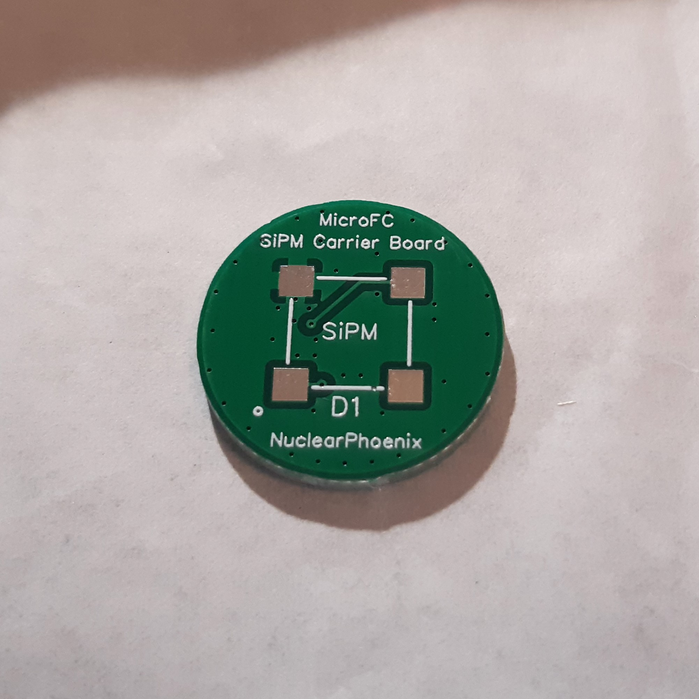
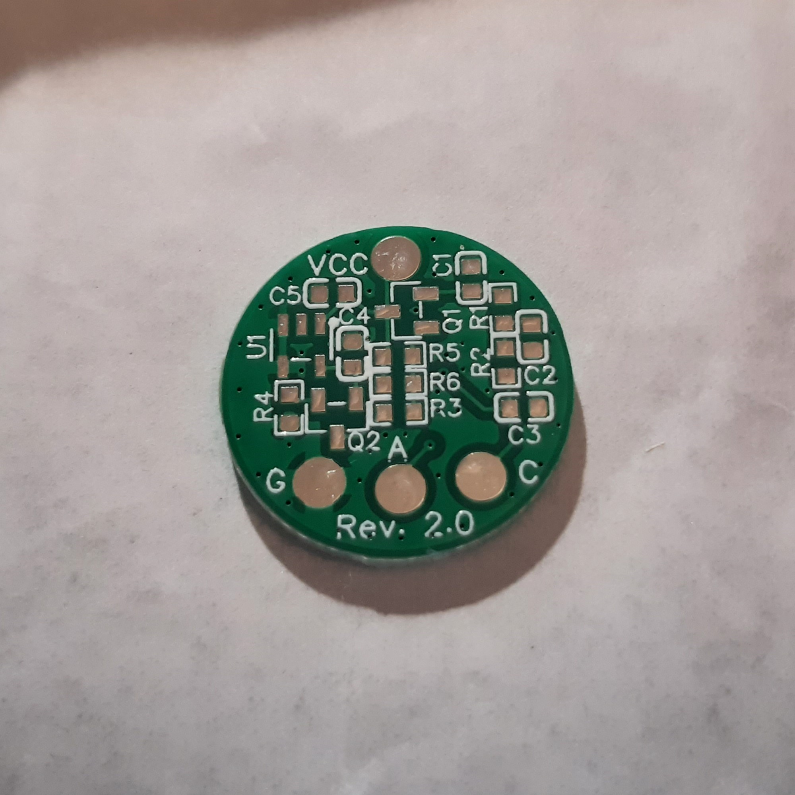
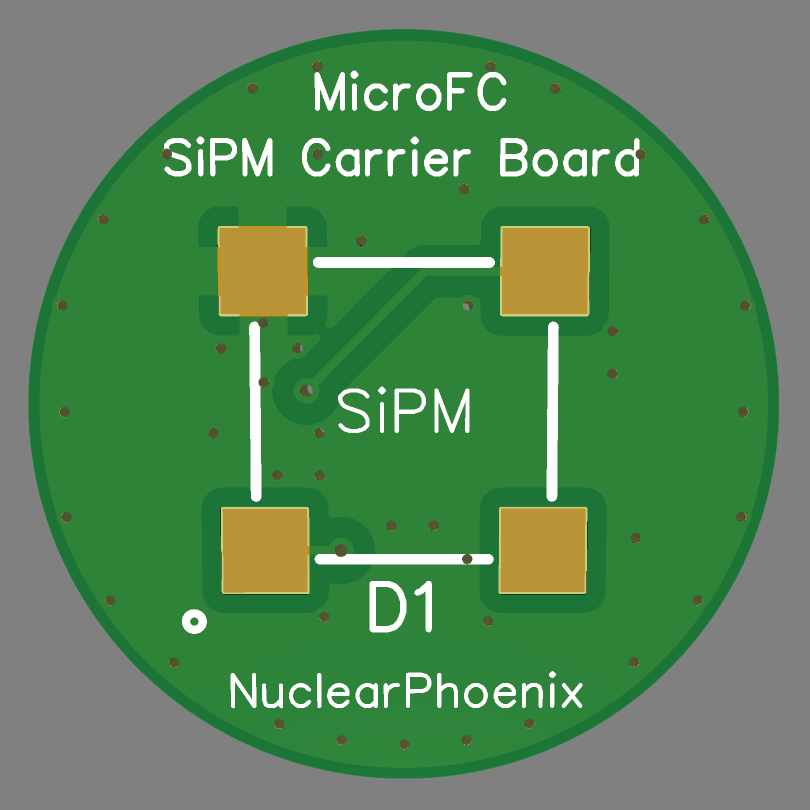
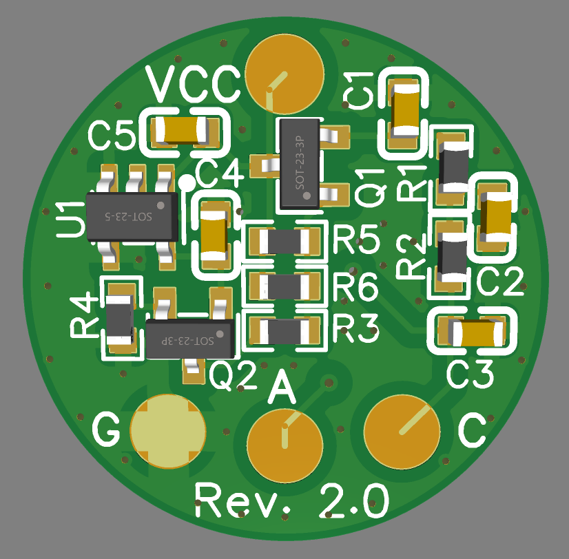
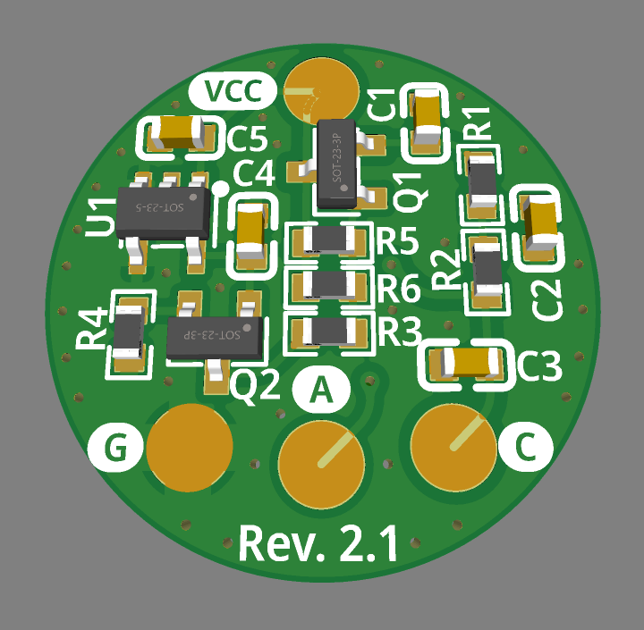

# MicroFC SiPM Carrier Board

Carrier board for a 6 mm C-Series MICROFC-60035-SMT silicon photomultiplier by [onsemi](https://www.onsemi.com/pdf/datasheet/microc-series-d.pdf) designed specifically to work with the [Open Gamma Detector](https://github.com/OpenGammaProject/Open-Gamma-Detector), but can be used with any other system. With additional (optional) circuitry for automatic SiPM temperature gain compensation.

PCB size is 18 x 18 mm. The solder pads for the SiPM are slightly bigger than they need to so that you can easily hand-solder everything! You can buy all the parts and the PCB using [Kitspace](https://kitspace.org/opengammaproject/MicroFC-SiPM-Carrier-Board) (non-affiliated).

  
  

  
  
  

On the front side there is only the sensor itself while all the other parts are on the back. This ensures good optical contact and light-tight sealing. The unused SiPM pin number 4 is connected to the ground pad for some added thermal mass and connection to the ground plane where the NTC also sits on.

The PCB includes the recommended SiPM [biasing filter](https://www.onsemi.com/pub/Collateral/AND9782-D.PDF) and temperature compensation that are optional to use. Enable them by soldering all the components on the board and then connect wires to the `VCC` and `GND` pads respectively. The SiPM signal "output" will be anode `A` pad. You can solder an additional wire to the cathode pad `C` in this case, so that you can easily check the voltage that is applied to the SiPM for setting the correct value for example. Do not leave it on there for normal operation though, except if you like antennas on sensitive electronics.

The temperature compensation circuitry is based on a [paper by Evgeny Kuznetsov](https://doi.org/10.1016/j.nima.2017.11.060) (Temperature-compensated silicon photomultiplier). Research and testing was mostly done by [@sebyon](https://github.com/sebyon), thanks a lot!

If you are connecting straight to the SiPM, do so via the cathode `C` and anode `A` pads and leave all the other components unsoldered. You should also use the GND pad in that case too.

