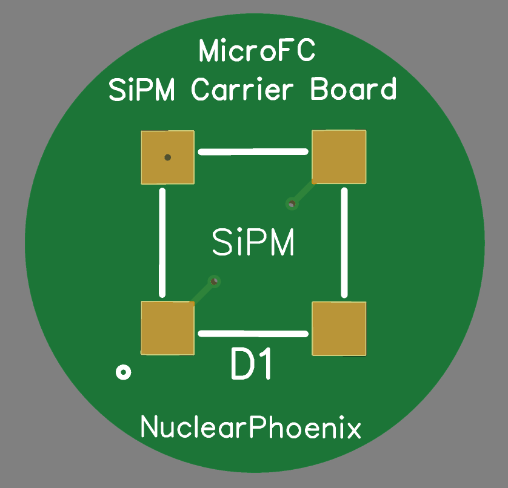
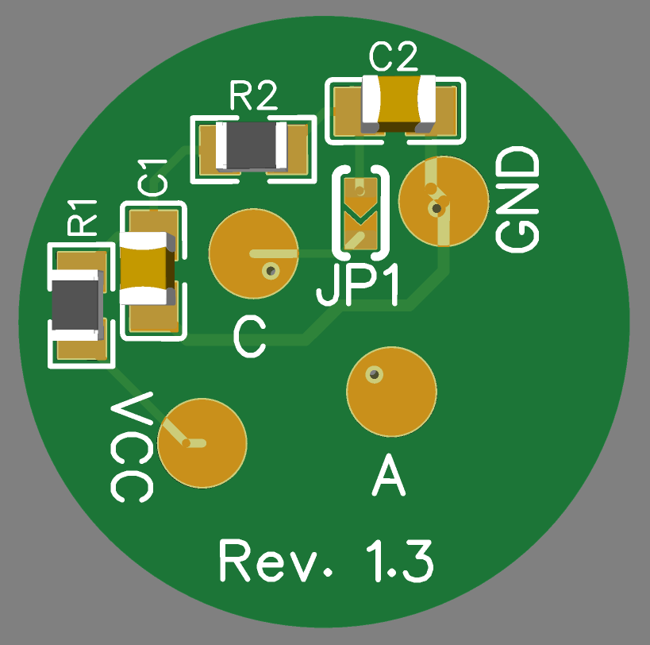
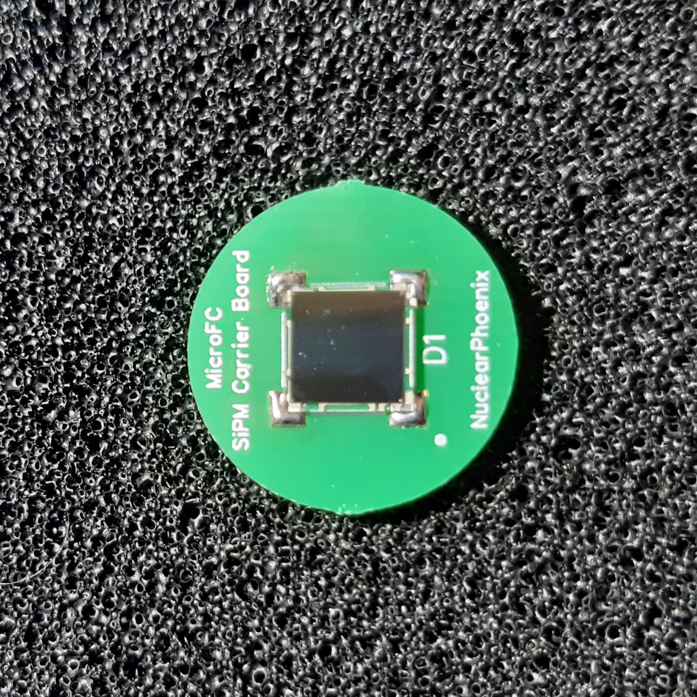
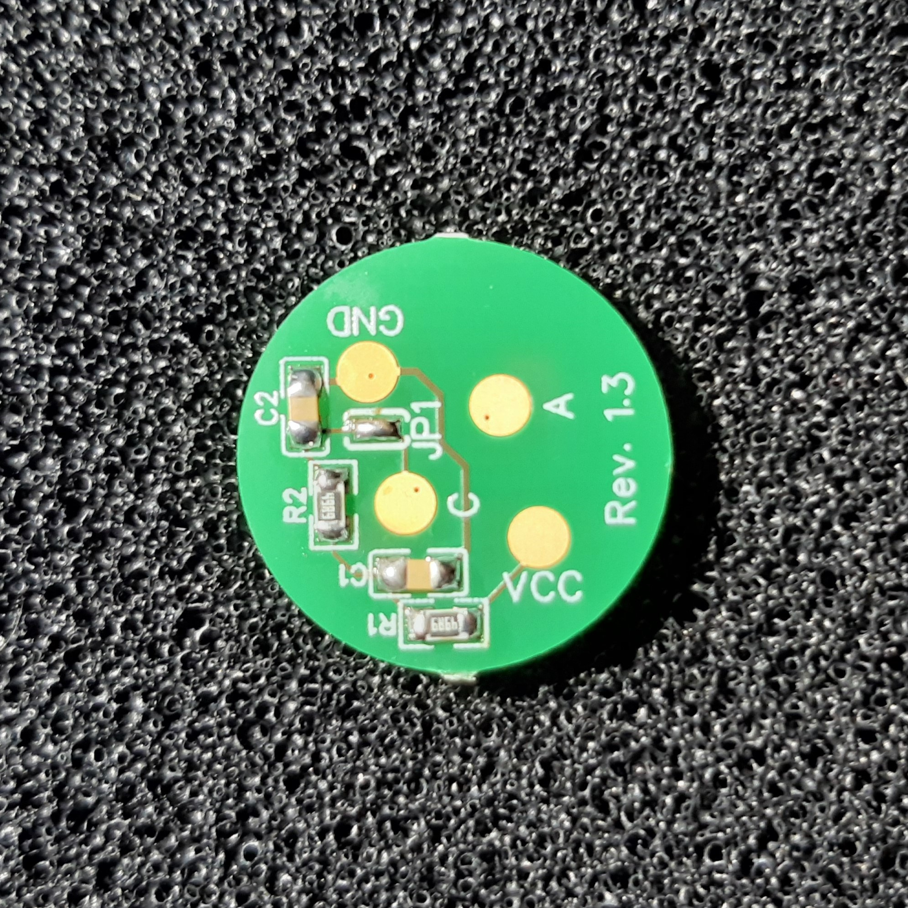

# MicroFC SiPM Carrier Board

Carrier board for a 6 mm C-Series MICROFC-60035-SMT silicon photomultiplier by [onsemi](https://www.onsemi.com/pdf/datasheet/microc-series-d.pdf) designed specifically to work with the [Open Gamma Detector](https://github.com/OpenGammaProject/Open-Gamma-Detector), but can be used with any other system.

PCB size is 18 x 18 mm. The solder pads for the SiPM are slightly bigger than they need to so that you can easily hand-solder everything! You can buy all the parts and the PCB using [Kitspace](https://kitspace.org/boards/github.com/opengammaproject/MicroFC-SiPM-Carrier-Board/).

  
  

On the front side there is only the sensor itself while all the other parts are on the back. This ensures good optical contact and light-tight sealing. The unused SiPM pin number 4 is connected to the ground pad for some added thermal mass.

The PCB includes the recommended SiPM [biasing filter](https://www.onsemi.com/pub/Collateral/AND9782-D.PDF) that is optional to use. Enable it by closing the solder jumper `JP1` and then soldering wires to the `VCC` and `GND` pads respectively. The SiPM signal will be anode `A` pad. Do not solder anything to the cathode pad in this case.

If you are connecting straight to the SiPM, do so via the cathode `C` and anode `A` pads and open the jumper `JP1`. You do not need the GND pad in that case.

  
  
  

